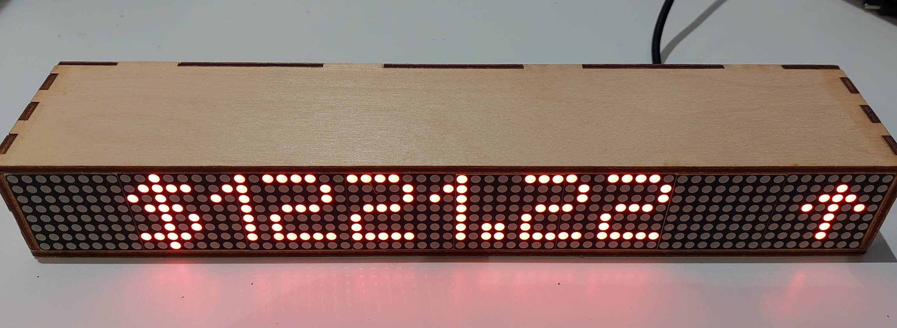
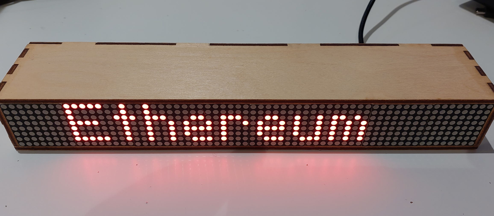
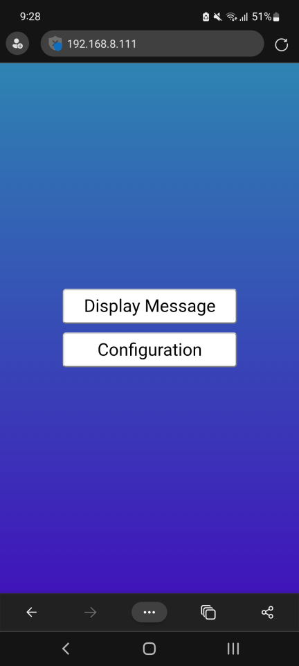
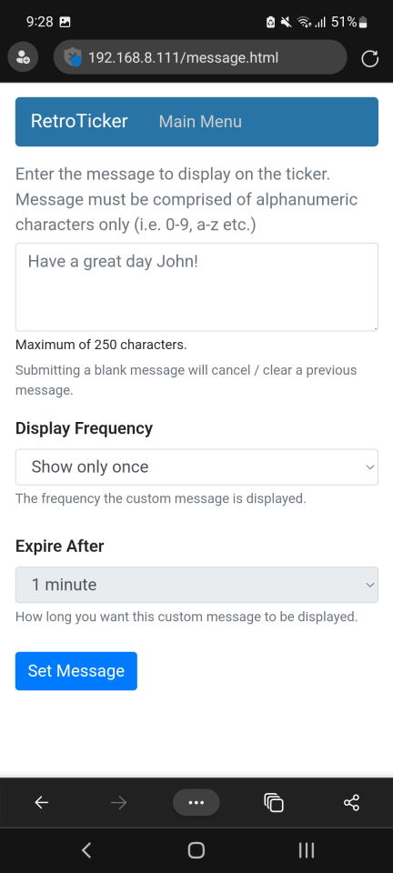
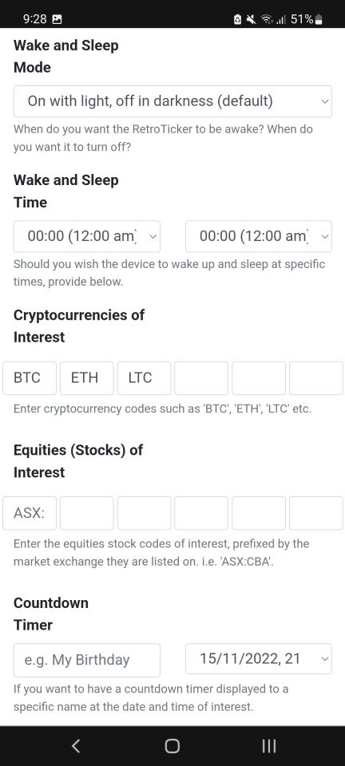
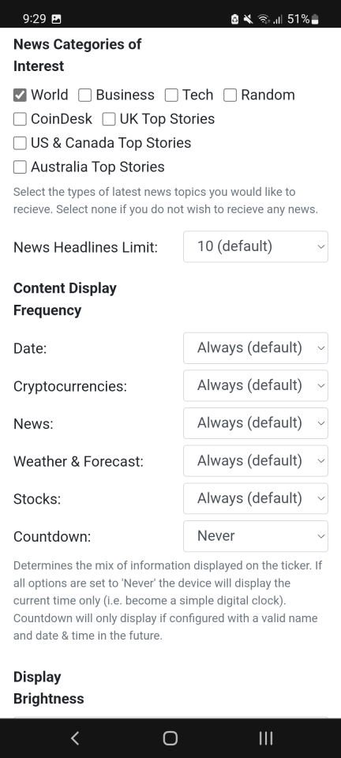
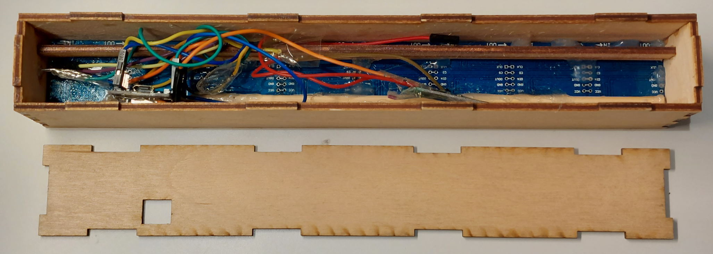
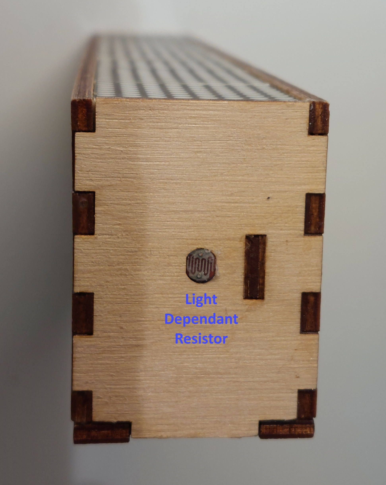

# RetroTicker
 A single colour LED scrolling ticker to keep you updated on how much money you're losing on stonks and crypto.
 
## Features

* Web interface to configure up to 6 stonks (only ASX at the moment), 6 cryptos, news, weather, weather forecast.
* Ability to randomly set a message to show up.

## How to build

1) Clone the git repository and open the folder using PlatformIO
2) [Wire up the device](design)
3) Compile and upload the firmware to the ESP8266 using PlatformIO
4) Upload the filesystem image as well using PlatformIO ('Run the 'upload file system image' task).

On first boot it will ask you to connect to the WiFi AP it creates, to configure the Internet Connection.

## TODO

* Find an source that can be used to get US, UK or any other countries stonk prices.

## Hardware Required

* [ESP8266](https://www.aliexpress.com/item/32651747570.html) (any ESP device should work, but I haven't tested)
* [2 x 4xMAXX7219 modules](https://www.aliexpress.com/item/4001131640516.html) (i.e. two chains of 4 x 8x8 LEDs in each module). Red, Green and Blue are the colours available. I prefer red as it better matches my stonks and/or crypto portfolio growth (loss).
* Optional: [Light Dependent Resistor](https://www.aliexpress.com/item/32760631393.html) and 1kohm resistor (if you want to have the brightness of LEDs adjust automatically, like your mobile phone display)

## In action

[https://user-images.githubusercontent.com/12006953/122657476-cd358d00-d15b-11eb-9c6c-99b61378c56a.mp4](https://user-images.githubusercontent.com/12006953/201777217-1e53e0d5-420d-4ed0-8cde-dc696f1cb63e.mp4)

## Construction
Refer to the design folder for the laser cutting diagrams. The ESP8266 (in this case, a WeMos D1 Mini) is inside.

